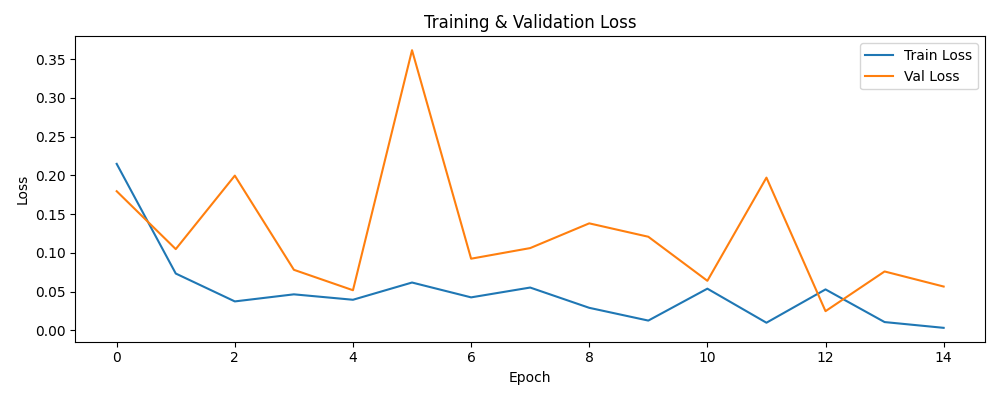
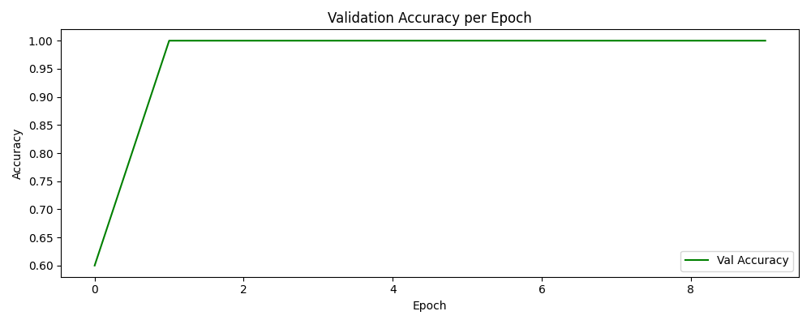
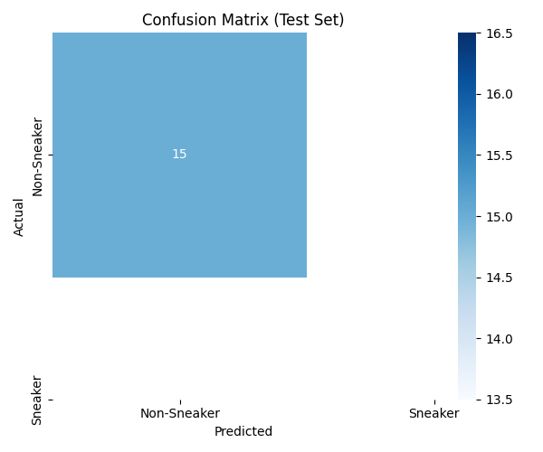

# Sneaker Recommendation System

A PyTorch computer vision pipeline that scores uploaded images with a binary sneaker classifier, surfaces similar catalog items via embedding similarity, and augments results with dominant-color labels and external shopping links. A Gradio web UI ties the pieces together for local demos.

## Features

- **Binary classification** — ResNet-18 (ImageNet weights disabled) predicts sneaker vs non-sneaker with a softmax confidence score.
- **Similar-product suggestions** — Embeddings from the penultimate layer are compared with **cosine similarity** against a precomputed embedding matrix for the catalog.
- **Gradio interface** — Upload an image, view the prediction string, recommended product block, and Markdown links.
- **Color explainability** — **K-means** (4 clusters) on image pixels, subsampled for speed, with RGB centers mapped to the nearest name in a small fixed palette (e.g. black, white, gray, red, green, blue, brown, beige).
- **External search links** — Query strings built from the recommended `product_name` open **Amazon**, **eBay**, and **Google** search URLs in the browser.

## Dataset

This project expects the Kaggle dataset **[Fashion Product Images (Small)](https://www.kaggle.com/datasets/paramaggarwal/fashion-product-images-small)** (fashion metadata plus JPEGs).

- **`styles.csv`** is filtered so `articleType` contains **`Sports Shoes`** (substring match).
- Up to **100** matching products that have a corresponding file under `data/images/<id>.jpg` are copied into **`data/filtered_images/`**.
- **`data/metadata.csv`** is generated by `src/utils.py` and stores `filename`, binary **`class`**, `product_name` (from `productDisplayName` when present), `color` (from `baseColour`), and placeholder fields used elsewhere in the template.

**Note:** In the current `filter_sneakers()` implementation, each copied sports-shoe image is registered **twice** in `metadata.csv` with classes **`1`** and **`0`** to balance row counts. Training therefore optimizes labels as written in that CSV, not a separate folder of true non-sneaker product photos. For stricter sneaker vs non-sneaker learning, extend the script to sample and copy images from other `articleType` values and assign a single label per file.

## Project structure

```text
project/
├── data/
│   ├── images/              # Raw JPEGs from Kaggle (after download / unzip)
│   ├── filtered_images/     # Subset copied by utils.py
│   ├── styles.csv           # Kaggle styles table
│   ├── metadata.csv         # Produced by utils.py
│   └── embeddings.npy       # Produced by embed.py
├── src/
│   ├── dataset.py
│   ├── model.py
│   ├── train.py
│   ├── embed.py
│   ├── recommend.py
│   └── utils.py
├── checkpoints/
│   └── best_model.pth       # Written by train.py
├── app/
│   └── gradio_app.py
├── outputs/
│   ├── loss_curve.png
│   ├── accuracy_curve.png
│   └── confusion_matrix.png
└── requirements.txt
```

## Installation

1. **Python 3** (version compatible with your PyTorch build; this repo was used with a local 3.13 virtualenv).

2. **Create and activate a virtual environment** (example):

   ```bash
   cd "/path/to/Recommendation system"
   python3 -m venv env
   source env/bin/activate          # Windows: env\Scripts\activate
   ```

3. **Install dependencies** — PyTorch builds are platform-specific; either pick a wheel from [pytorch.org](https://pytorch.org/get-started/locally/) first, or install everything from `requirements.txt` (adjust if you need a specific CUDA build):

   ```bash
   pip install -r requirements.txt
   ```

## Kaggle dataset download

1. Create a Kaggle API token (`kaggle.json`) and place it in `~/.kaggle/` as described in Kaggle’s documentation.
2. Install the CLI: `pip install kaggle`.
3. Download and unzip into your project so paths align with `src/utils.py` (`data/styles.csv`, `data/images/*.jpg`):

   ```bash
   kaggle datasets download -d paramaggarwal/fashion-product-images-small
   unzip -q fashion-product-images-small.zip -d data_tmp
   ```

   Move or merge contents so **`data/styles.csv`** and **`data/images/`** exist at the repository-relative paths above (exact inner layout depends on the zip; adjust `CSV_PATH` / `RAW_IMAGES` in `utils.py` if your folders differ).

## Data preparation

From the **project root** (so `data/` resolves correctly):

```bash
python3 src/utils.py
```

This runs `filter_sneakers()`, copies eligible images, and writes **`data/metadata.csv`**.

## Training

Training uses `SneakerDataset` (`data/metadata.csv`, `data/filtered_images`), **Adam** (`lr=0.001`), **CrossEntropyLoss**, batch size **8**, **3** epochs, and saves weights to **`checkpoints/best_model.pth`**.

```bash
python3 src/train.py
```

Run this from the project root so imports resolve (`dataset` / `model` live next to `train.py` under `src/`).

## Embedding generation

Builds vectors from the backbone (final fully connected layer removed), stacks them, and saves **`data/embeddings.npy`** aligned with row order in `metadata.csv`.

```bash
python3 src/embed.py
```

Requires an existing **`checkpoints/best_model.pth`** and the same `data/metadata.csv` / `data/filtered_images/` used in training.

## Running the Gradio app

```bash
python3 app/gradio_app.py
```

The app loads the checkpoint, `data/embeddings.npy`, and `data/metadata.csv`, then launches Gradio (default local URL is printed in the terminal). Upload an image and click **Run**.

## Results

The figures below summarize a training run exported to `outputs/` (e.g., loss logging, validation metrics, and a test-set confusion matrix). They support qualitative assessment of optimization dynamics and discrimination between the two supervised classes.

### Training and validation loss



The curve compares empirical risk on the training split with loss on a held-out validation split across epochs. A steady decline in training loss indicates parameter updates are reducing the classification objective, while the validation trace characterizes generalization; elevated volatility on validation relative to training is common for small batches and limited data.

### Validation accuracy



Validation accuracy is the fraction of correctly labeled validation examples after each epoch. A rapid rise followed by a plateau suggests the decision boundary stabilizes early under the chosen optimizer settings, though perfect scores on small validation sets should be interpreted cautiously alongside external testing.

### Confusion matrix (test set)



The matrix cross-tabulates reference labels (rows) against argmax predictions (columns) for the binary task. Diagonal mass corresponds to correct **Sneaker** versus **Non-Sneaker** assignments; off-diagonal cells quantify misclassification patterns and are informative for diagnosing class-specific bias when sample sizes are comparable.

## Demo

The Gradio front end presents three functional regions: an image upload widget, a read-only **Detected** field reporting softmax confidence for the binary head, and a Markdown panel that renders the retrieved catalog title, K-means color readout, and outbound commerce links. This layout keeps inference, similarity-based retrieval, and lightweight explainability in a single view suitable for informal user studies or demonstrations.

A static full-window capture of the running UI is not included under `outputs/` in this repository. To illustrate the interface in this document, save a screenshot as `outputs/gradio_ui.png` next to the training figures and add `` under this heading.

## How recommendation works

1. The uploaded image is resized to **224×224**, tensorized, and passed through **full ResNet-18** for classification logits; softmax yields **class** and **confidence**.
2. The same tensor is passed through **`embed_model`** (ResNet without the final `fc`), flattened to a vector.
3. **Cosine similarity** is computed between that vector and every row of **`embeddings.npy`**.
4. The **highest-similarity index after skipping the top match** (simple self-match avoidance in the current UI) selects a metadata row; its **`product_name`** drives the Markdown title and search links.

Batch-style retrieval and richer explanations are also sketched in **`src/recommend.py`** (top-k neighbors, optional reason strings from class/color metadata).

## Color detection (KMeans)

`detect_colors` in **`src/utils.py`** (used by **`app/gradio_app.py`**):

1. Converts the PIL image to an RGB array and reshapes to `(N, 3)`.
2. Randomly subsamples up to **3000** pixels when the image is large.
3. Fits **KMeans** with **`k=4`**, `n_init=10`.
4. Maps each cluster center RGB to the **closest** entry in a small named palette via Euclidean distance in RGB space.
5. De-duplicates names before returning.

This is a lightweight visual hint, not a guaranteed fashion-color label from the dataset.

## Example output

- **Detected** — A short string such as `Sneaker (87.3%)` or `Other (72.1%)` from the classifier head.
- **Recommendation panel** — Markdown with the matched **`product_name`**, a comma-separated **Detected Color** list from K-means, and clickable **Amazon / eBay / Google** links built from the product name query.

## Technologies used

| Area | Stack |
|------|--------|
| Deep learning | PyTorch, torchvision (ResNet-18, `weights=None`) |
| Data | pandas, NumPy |
| Similarity | scikit-learn `cosine_similarity` |
| Clustering | scikit-learn `KMeans` |
| UI | Gradio |
| Images | Pillow |

## Notes and limitations

- **Small catalog** — Default preparation caps at **100** sports-shoe SKUs with files present; metrics and generalization are limited.
- **Label semantics** — As shipped, `metadata.csv` duplicates each image under both classes; refine `utils.py` if you need true sneaker vs non-sneaker imagery.
- **No pretrained backbone** — Training starts from random ResNet-18 weights; more data or pretraining would usually help.
- **Embeddings / checkpoint alignment** — Re-run **`embed.py`** after retraining or changing `metadata.csv` row order.
- **Search links** — URLs are generic marketplace/search pages; availability and results depend on third-party sites and the encoded query string.

## Optional: offline recommendation demo

After embeddings exist:

```bash
python3 src/recommend.py
```

Uses `recommend(0)` in the `if __name__ == "__main__"` block to print a sample top-k recommendation for index `0`.
